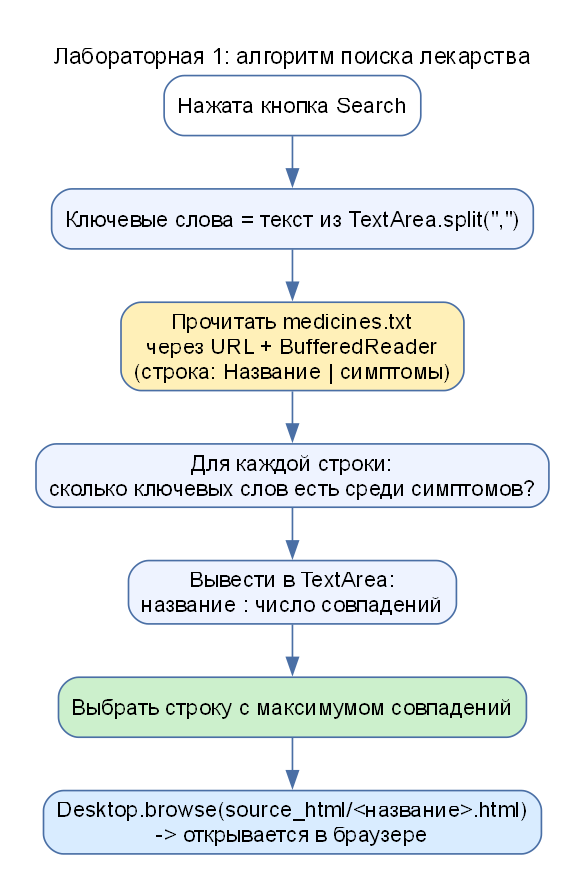

# АИРП-1. Теория подробно

## 1. Что делает программа (в одном абзаце)

Пользователь вводит ключевые слова (симптомы). Программа **читает файл со списком лекарств**, для каждого лекарства **считает, сколько введённых слов встречается среди его симптомов**, показывает результат и **открывает в браузере html-страницу** лекарства с максимальным числом совпадений.

## 2. URL: что это и зачем в этой лабе

**URL (Uniform Resource Locator)** – адрес ресурса: «где лежит и как получить». Состав: `протокол://узел/путь`, например:

- `http://localhost:8080/index.html` – по сети, протокол HTTP;
- `file:///E:/lab/medicines.txt` – локальный файл, протокол `file`.

В Java есть класс `URL` и `URLConnection`. Через них файл читается тем же способом, что и ресурс из интернета: поэтому лаба называется «поиск в **удалённых URL-ресурсах**». У нас ресурс локальный, но код (`file.toURI().toURL()`, `openConnection()`, `getInputStream()`) работал бы и для адреса в сети.

## 3. Потоки ввода-вывода: цепочка «байты → символы → строки»

Файл – это последовательность **байтов**. Чтобы получить **строки текста**, потоки «надевают» друг на друга:

| Класс | Что делает |
|---|---|
| `InputStream` (из `URLConnection.getInputStream()`) | отдаёт сырые **байты** |
| `InputStreamReader(..., "UTF-8")` | превращает байты в **символы** (учитывая кодировку; для русского нужен UTF-8) |
| `BufferedReader` | **буфер**: читает большими порциями и выдаёт по **строке** методом `readLine()`; `null` – конец файла |

Почему так: чтение по одному байту с диска очень медленное, буфер ускоряет работу (одно из трёх назначений буфера – выравнивание скоростей, см. [ТЕОРИЯ_ИЗ_ЧАТА_АИРП.md](ТЕОРИЯ_ИЗ_ЧАТА_АИРП.md)).

**try-with-resources:** `try (BufferedReader reader = ...) { ... }` – после блока `reader` закрывается автоматически, даже при ошибке.

## 4. Список файлов в папке

Класс `File` описывает файл или папку. Для папки метод `listFiles()` возвращает массив файлов внутри: `new File("source_html").listFiles()`. В заготовке методички по этому списку программа перебирает html-документы и считает совпадения внутри каждого. В нашем варианте перебираются строки текстового файла, а html-документ открывается только для победителя.

## 5. Как открыть браузер из программы

`Desktop.getDesktop().browse(uri)` – попросить операционную систему открыть адрес **программой по умолчанию** (для `http`/`file` – браузером). `uri` получают из файла: `file.getAbsoluteFile().toURI()` – превращает путь в адрес `file:///...`.

## 6. Графическое окно на AWT

**AWT** (Abstract Window Toolkit) – стандартная библиотека окон Java.

| Класс | Что это |
|---|---|
| `Frame` | окно |
| `Button` | кнопка |
| `TextArea` | многострочное текстовое поле |
| `Color` | цвет (`new Color(150, 200, 100)` – RGB) |
| `setLayout(null)` | отключить автоматическую раскладку: положение каждого элемента задаётся вручную `setBounds(x, y, ширина, высота)` |

### События

Когда пользователь нажимает кнопку, должен сработать код. В Java для этого:

1. окно **реализует интерфейс** `ActionListener` (метод `actionPerformed(ActionEvent e)`);
2. кнопке сообщают «слушателя»: `button.addActionListener(this)`;
3. при нажатии Java вызывает `actionPerformed`; `e.getSource()` показывает, какая именно кнопка нажата.

`WindowAdapter` / `windowClosing` – обработчик закрытия окна крестиком (`System.exit(0)` – завершить программу).

## 7. Подсчёт совпадений

Строка файла: `Парацетамол | головная боль, высокая температура, боль в горле, озноб`.

1. Разделить по `|` на название и симптомы: `line.split("\\|")`.
2. Ключевые слова – введённый текст, разделённый по запятым: `text.split(",")`.
3. Для каждого ключевого слова: если **строка симптомов (в нижнем регистре)** содержит это слово (`contains`, без пробелов по краям – `trim()`), счётчик +1.
4. Лекарство с максимальным счётчиком – ответ. При равенстве выбирается первое найденное.

## 8. Что такое «релевантный» документ

Релевантный – соответствующий запросу. Чем больше ключевых слов совпало, тем выше релевантность.
