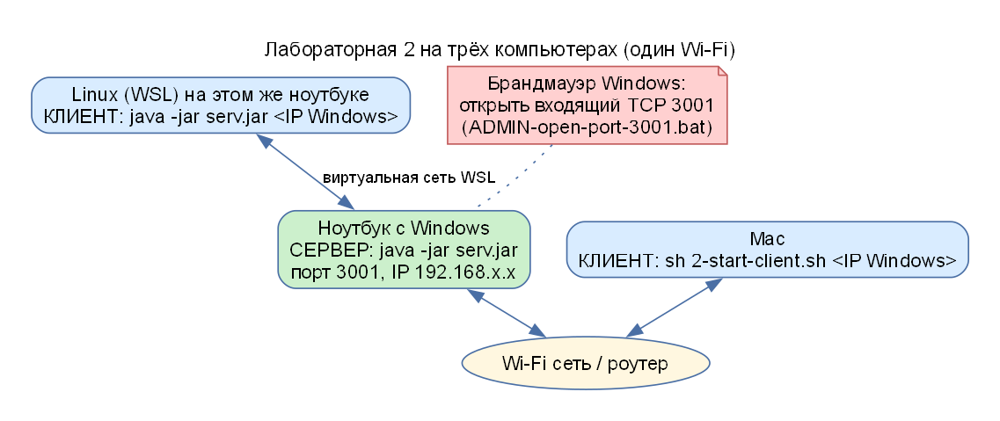
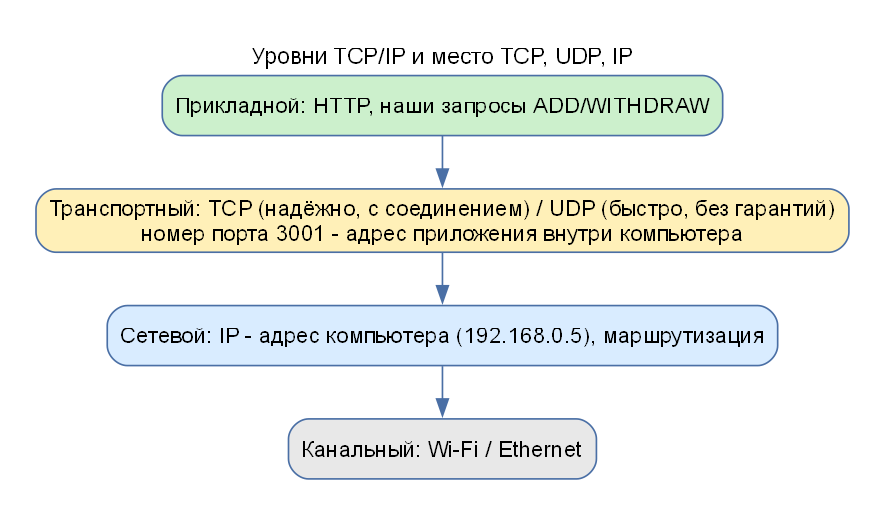

# АИРП: разбор теории из сообщений в чате

Здесь собраны **все подсказки одногруппников и старосты** про защиту АИРП и ССП и к каждой написано, что это значит, простыми словами. Если на защите спросят из этого списка, ответ можно взять отсюда.

## Организационное

- Отчёты по АИРП и ССП принимаются **только в печатном виде**; на лабу нужно приносить **печатный отчёт** и **подписанный конспект АИРП**.
- Выполнение и защита – **по одному человеку** (каждый делает и защищает свою работу сам).
- По АИРП и по ССП: **сначала общее задание, потом задание по варианту**.
- Контрольные работы по ССП бывают без предупреждения.

## 1. Назначение буфера (выучить)

> «выучить назначение буфера» · «знать, зачем нужен буфер (говорили на лекции, только эти пункты)»

**Буфер** – область оперативной памяти, куда данные временно помещают при передаче между двумя участниками, работающими с разной скоростью. Три назначения (отвечать именно так):

1. **Выравнивание скорости операций чтения-записи** между медленным диском и быстрой оперативной памятью.
2. **Асинхронный ввод-вывод:** программа продолжает работать, пока данные докачиваются в буфер.
3. **Кэширование данных:** повторное чтение берётся из буфера, а не с диска.

**Где буфер в наших лабораторных:**

| Лаба | Где буфер |
|---|---|
| АИРП 1 | `BufferedReader` читает файл большими порциями, а программе выдаёт по строке (`readLine()`) |
| АИРП 2 | `PrintStream` накапливает данные в буфере, `flush()` принудительно отправляет их в сеть; `BufferedReader` на стороне сервера |
| АИРП 3 | `byte[] buffer = new byte[4096]` в `ImageServlet`: рисунок копируется в ответ порциями по 4096 байт |

## 2. Массив, ArrayList и List (знать отличие)

> «всем знать отличие array list от array и list, термин листа взять из пролога!!!»

| Что | Размер | Типизация | Пример |
|---|---|---|---|
| **Массив** (array) | **фиксирован** при создании | тип элементов один и задан | `int[] a = new int[5];` |
| **ArrayList** | изменяется (добавляйте элементы) | в Java – `ArrayList<E>`; в C# старый `ArrayList` хранит `object` (упаковка) | `ArrayList<String> list = new ArrayList<>();` |
| **List** | изменяется | интерфейс списка (Java `List<E>`, C# `List<T>`) | `List<int> l = new List<int>();` |

**«Термин списка из Пролога»:** список – **упорядоченная последовательность элементов**, например `[a, b, c]`; в Прологе список – основная структура данных (голова + хвост: `[H|T]`). В программировании «список» – это абстракция «последовательность элементов, которую можно менять», а `ArrayList` – одна из реализаций (на основе массива, который автоматически увеличивается). В Java `List` – **интерфейс**, `ArrayList` – **класс**, который его реализует.

Отличие в одной фразе: **массив – фиксированный размер, `ArrayList` – растущий список на основе массива, `List` – общее понятие/интерфейс списка**.

## 3. Куча, стек, кэш (из чата перед защитой сокетов)

> «куча, стек, кеш, листэнэбл, асинхронный ввод-вывод, три назначения буфера, сокет, класс PrintWriter»

Полный разбор – в **[ПАМЯТЬ.md](ПАМЯТЬ.md)**. Кратко:

- **Стек** – область памяти для локальных переменных и вызовов методов (LIFO), у каждого потока свой.
- **Куча** – область памяти для объектов (`new`), общая для потоков, освобождается сборщиком мусора.
- **Кэш** – быстрая память между процессором и ОЗУ (аппаратный) либо программный кэш результатов.
- **Асинхронный ввод-вывод** – операции чтения-записи выполняются «в фоне», программа не ждёт их завершения.
- **Сокет** – программная точка соединения двух приложений (IP-адрес + порт).
- **`PrintWriter` / `PrintStream`** – классы для вывода **текста** с методами `print`/`println`.

### Что такое «листэнэбл» (уточнение)

В сообщении встречается слово «листэнэбл». Точный смысл из текста сообщения установить нельзя; вероятно имеется в виду либо **Listener** (слушатель событий, как `ActionListener` у кнопки), либо **Runnable/Thread** (то, что выполняется в потоке), либо **Iterable/List**. Для защиты полезно знать все три:

- **Listener (слушатель)** – объект, которому сообщают о событии (нажатие кнопки): интерфейс `ActionListener`, метод `actionPerformed`. В АИРП 1 и 2 кнопки «слушают» именно так.
- **Runnable** – интерфейс «то, что можно выполнить в потоке» (метод `run()`); `Thread` уже реализует `Runnable`.
- **Iterable/List** – «то, что можно перебирать в цикле».

> **Уточните у старосты или одногруппницы, какое слово имелось в виду, и добавьте сюда.**

## 4. Сокеты, потоки, процессы

> «по заданию у кого-то сокеты через потоки, у кого-то через процесс. Потоки через глобальную переменную»

- **Через потоки (наш вариант):** сервер и клиенты – это **потоки одного процесса** (`class Account extends Thread`, `class clientThread extends Thread`). Они работают в **одной памяти**, поэтому счёт хранится в **глобальной (статической) переменной** `static int amount` – её видят все потоки.
- **Через процессы:** сервер и клиент – разные запущенные программы с отдельной памятью. Общей переменной у них нет, данные идут **только через сокет** (или файл, канал). Чтобы показать этот вариант, можно запустить сервер и клиентов как отдельные программы (на разных компьютерах, как в нашей многомашинной демонстрации: `java -jar serv.jar` на сервере и `java -jar serv.jar <IP сервера>` на клиентах).

## 5. «На защиту брать жертву (3 компьютера)»

> «на защиту брать жертву (3 компьютера) – сервер и два клиента (по Wi-Fi, по очереди отправлять на него запрос). Надо знать IP и порт, TCP/IP отличия»

Преподаватель просит показать сокеты **на трёх компьютерах**: один – **сервер**, два – **клиенты**; клиенты **по очереди** отправляют запрос серверу по Wi-Fi.

Как это сделать с нашей программой – подробная инструкция в `airp/lab2/docs/01-ЗАПУСК.md`. Коротко: на ноутбуке запустить сервер (`1-start-server.bat`), узнать IP (`show-ip.bat`), открыть порт 3001 в брандмауэре (`ADMIN-open-port-3001.bat` от администратора), на других компьютерах запустить клиент с этим IP (`2-start-client.bat 192.168.x.x` или `sh 2-start-client.sh 192.168.x.x`).

**Что нужно знать:**

- **IP-адрес** – адрес компьютера в сети (например, `192.168.0.5`). `127.0.0.1` – «этот же компьютер» (loopback).
- **Порт** – номер «двери» приложения внутри компьютера (у нас `3001`); одному порту соответствует одно слушающее приложение.
- **TCP** – протокол с установлением соединения, гарантирует доставку и порядок; **UDP** – без соединения и без гарантий, быстрее. **IP** – протокол более низкого уровня: адресация и маршрутизация пакетов; TCP и UDP работают **поверх** IP (отсюда «TCP/IP»).

| | TCP | UDP |
|---|---|---|
| Соединение | устанавливается | нет |
| Доставка | гарантирована, порядок сохраняется, потерянное передаётся повторно | не гарантирована |
| Классы Java | `Socket`, `ServerSocket` | `DatagramSocket`, `DatagramPacket` |
| Пример | веб-страницы, наша лаба | видео, голос |

## 6. Прочее из чата

- «**Конспекты АИРП носить на каждую лабу и подписать**» – организационное.
- «**Выполнение и защита по одному**» – каждый защищает свою работу, поэтому код и отчёт должны быть понятны вам лично: читайте разбор кода (`04-РАЗБОР-КОДА.md`) и защиту (`05-ЗАЩИТА.md`) каждой лабы.
