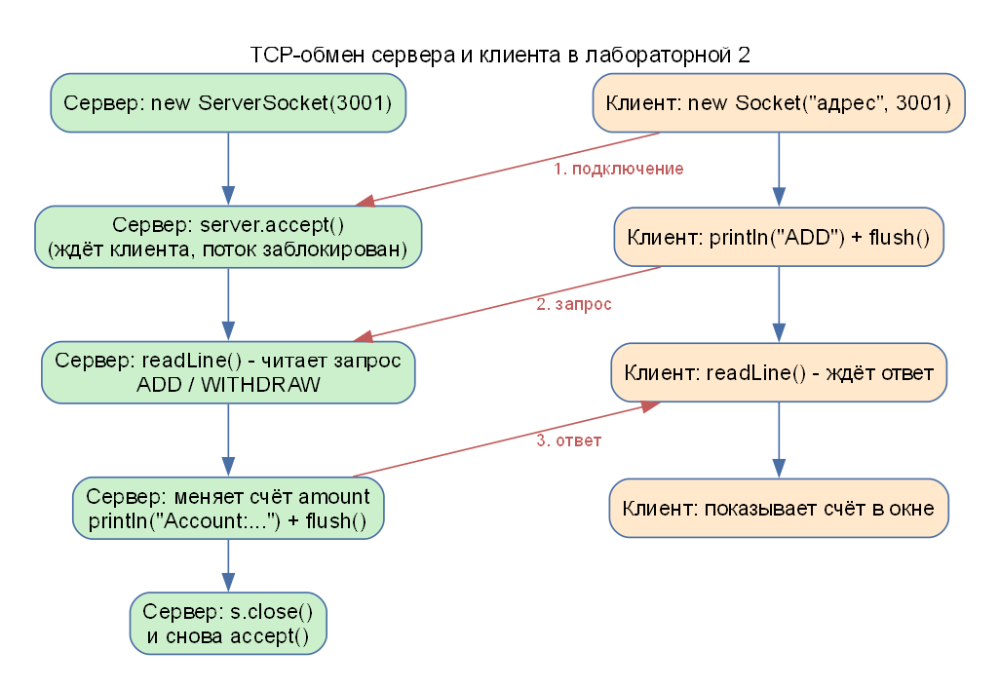
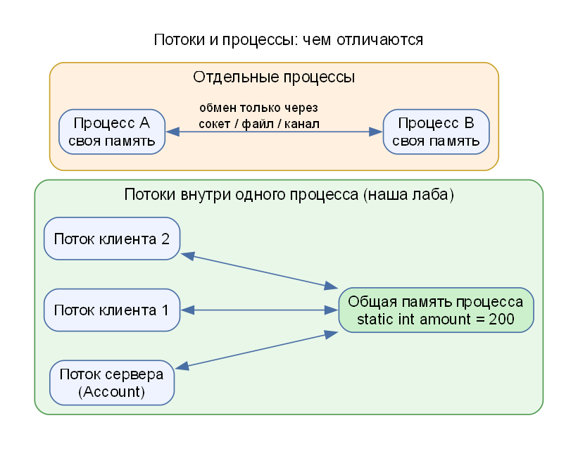

# АИРП-2. Теория подробно

Сопутствующие материалы: [ТЕОРИЯ_ИЗ_ЧАТА_АИРП.md](ТЕОРИЯ_ИЗ_ЧАТА_АИРП.md) (буфер, потоки/процессы, три компьютера) и [ПАМЯТЬ.md](ПАМЯТЬ.md).

## 1. Сокет, IP, порт

Представьте многоквартирный дом: **IP-адрес** – это адрес дома, **порт** – номер квартиры, а **сокет** – «розетка», в которую подключается разговор.

- **IP-адрес** – адрес компьютера в сети (`192.168.0.5`). `127.0.0.1` («localhost», loopback) – «этот же компьютер».
- **Порт** – число 0–65535, адрес **приложения** внутри компьютера. Мы используем `3001`. Если порт занят другой программой, сервер не запустится.
- **Сокет** – программный объект, представляющий конец соединения: пара «IP + порт».
- **ServerSocket** – серверный сокет: «слушает» порт и принимает подключения.
- **Socket** – клиентский сокет: подключается к серверу, через него читают и пишут.

## 2. TCP и UDP

| | TCP | UDP |
|---|---|---|
| Соединение | устанавливается | нет |
| Доставка | гарантирована | нет гарантии |
| Порядок данных | сохраняется | не гарантируется |
| Потерянные пакеты | передаются повторно | теряются |
| Скорость | медленнее | быстрее |
| Классы Java | `Socket`, `ServerSocket` | `DatagramSocket` |

В лабе используется **TCP** (классы `ServerSocket` и `Socket`). **IP** – протокол более низкого уровня (адресация, маршрутизация); TCP и UDP работают поверх IP.

## 3. Как проходит обмен

1. **Сервер** создаёт `new ServerSocket(3001)` и вызывает `accept()`: поток **блокируется** (ждёт), пока кто-то не подключится.
2. **Клиент** создаёт `new Socket("адрес", 3001)` – подключение установлено; `accept()` у сервера возвращает объект `Socket` для этого клиента.
3. Клиент **отправляет** строку запроса (`println("ADD")`, `flush()`).
4. Сервер **читает** строку (`readLine()`), меняет счёт и **отправляет** ответ «Account:число».
5. Клиент **читает** ответ (`readLine()`) и показывает его.
6. Сервер закрывает соединение (`s.close()`) и возвращается к `accept()` – ждать следующего клиента.

## 4. Классы ввода-вывода

| Класс | Назначение |
|---|---|
| `PrintStream` | вывод **текста** (`print`, `println`) в поток (сокета, файла); `flush()` принудительно отправляет накопленное в буфере |
| `DataInputStream` | чтение из потока; метод `readLine()` читает строку до символа конца строки (метод устарел; в современном коде используют `BufferedReader`) |
| `BufferedReader` + `InputStreamReader` | чтение текста построчно с буфером (используется на сервере) |
| `socket.getOutputStream()` / `getInputStream()` | потоки записи и чтения конкретного соединения |

**Почему `PrintStream`, а не `ObjectOutputStream`?** Передаются простые текстовые сообщения, а не Java-объекты.

**Зачем `flush()`?** `PrintStream` накапливает данные в буфере; `flush()` отправляет их немедленно, иначе собеседник может долго ждать.

**Что делает `readLine()`?** Читает данные до символа конца строки; поэтому отправитель использует `println` (добавляет конец строки). Возвращает `null`, если поток закрыт.

## 5. Потоки (threads)

**Поток** – независимая последовательность выполнения внутри программы. Класс, наследующий `Thread`, переопределяет `run()`; запуск – `start()`.

Зачем потоки здесь:

1. серверу нужно **постоянно ждать** новые подключения (`accept()` блокирует поток);
2. обработка одного клиента не должна блокировать окно;
3. нажатие кнопки запускает **отдельный поток клиента**, окно остаётся «живым».

Если выполнить `accept()` или чтение сокета в потоке окна, оно «зависнет».

**Общая переменная:** `static int amount = 200;` – поле класса, одно на все объекты; потоки одного процесса видят её одинаково («потоки через глобальную переменную»). Изменяет её только серверный поток, поэтому гонок данных нет. Если бы несколько потоков меняли счёт одновременно, понадобилась бы синхронизация (`synchronized`).

## 6. Протокол нашей программы

| Запрос клиента | Что делает сервер | Ответ |
|---|---|---|
| `ADD` | `amount += случайное (0–999)` | `Account:<счёт>` |
| любой другой (`WITHDRAW`) | `amount -= случайное (0–999)` | `Account:<счёт>` |

Передача **от клиента к серверу** (обратное направление): клиент использует `PrintStream` поверх `getOutputStream()`, сервер читает `BufferedReader` поверх `getInputStream()`: это ответ на контрольный вопрос 3.

## 7. Вариант 2

Требование: **два клиента через потоки; один клиент добавляет и снимает деньги, второй только снимает**. Реализация: три кнопки – «Клиент 1: добавить», «Клиент 1: снять», «Клиент 2: снять». Каждое нажатие создаёт новый `clientThread` с именем клиента и командой.

## 8. Определение сетевого адреса компьютера

- Windows: `ipconfig` (строка IPv4-адрес).
- Mac/Linux: `ifconfig` или `hostname -I` / `ip addr`.
- Java: `InetAddress.getLocalHost().getHostAddress()` или перебор `NetworkInterface` (так делает наш метод `localAddresses()`).
