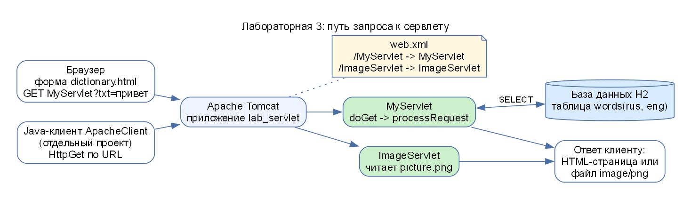

# АИРП, лабораторная работа 3. Как запустить

Тема: **Работа с серверными классами (сервлеты)**. Общее задание: словарь с базой данных переводов, обратный перевод, клиент и сервер в двух разных проектах. **Вариант 2:** сервлет, возвращающий клиенту файл с рисунком. Код в папке `airp/lab3`.



## Что нужно

| Что | Версия | Зачем | Проверка |
|---|---|---|---|
| **JDK** | 17 или новее | компиляция, запуск | `javac -version` |
| **Maven** | 3.9 или новее | сборка WAR-архива и клиента | `mvn -version` |
| **Apache Tomcat** | **9.x** (поддерживает `javax.servlet`) | сервер сервлетов | после запуска страница `http://localhost:8080/` |
| Браузер | любой | открывать страницу | |
| Интернет | при первой сборке | Maven скачает библиотеки | |

> **Tomcat 9, а не 10 и выше:** в Tomcat 10+ пакет `javax.servlet` заменён на `jakarta.servlet`, и этот код не заработает.

На ноутбуке автора всё уже установлено: JDK и Maven в `E:\tools`, Tomcat в `E:\tools\apache-tomcat-9.0.122`.

## Быстрый запуск (Windows, ноутбук автора)

В папке `airp/lab3`:

1. Двойной щелчок **`1-build-and-start-tomcat.bat`**: собирает WAR, копирует в Tomcat, запускает Tomcat в отдельном окне.
2. Через 5–10 секунд открыть в браузере **http://localhost:8080/lab_servlet/**.
3. Клиент (отдельный проект): двойной щелчок **`2-run-client.bat`**.
4. По окончании: **`3-stop-tomcat.bat`**.

Если Java, Maven или Tomcat лежат в других папках, откройте `.bat` в блокноте и измените три строки `set ...`.

## Запуск вручную (на любом компьютере)

### Сервер (проект `lab_servlet`)

```bash
cd airp/lab3/lab_servlet
mvn package
```

Результат: `target/lab_servlet.war`. Затем:

1. Скопировать `lab_servlet.war` в папку `webapps` вашего Tomcat 9.
2. Запустить Tomcat: `bin\startup.bat` (Windows) или `bin/startup.sh` (Mac, Linux). Нужна переменная `JAVA_HOME`.
3. Открыть http://localhost:8080/lab_servlet/ – стартовая страница `dictionary.html`.

### Клиент (проект `apacheclient`)

```bash
cd airp/lab3/apacheclient
mvn package
java -jar target/apacheclient-1.0.jar
```

Откроется окно «Словарь (клиент)». Tomcat с сервером должен быть уже запущен.

## Что проверить в браузере

| Адрес | Что должно быть |
|---|---|
| `http://localhost:8080/lab_servlet/` | страница со словарём и тремя формами |
| ввод «привет» → «Перевести» | `привет - hello`; адрес вида `.../MyServlet?txt=привет` |
| ввод «book» в нижней форме → «Перевести обратно» | `book - книга` |
| слово «мышь» | сообщение «Слово «мышь» не найдено» |
| «Показать рисунок» | рисунок (дом, солнце), адрес `.../ImageServlet` |

Слова в базе: привет–hello, дом–house, книга–book, студент–student, компьютер–computer, вода–water, солнце–sun, друг–friend, школа–school, город–city.

## Если не работает

| Симптом | Причина и решение |
|---|---|
| `http://localhost:8080` не открывается | Tomcat не запущен (посмотрите окно Tomcat) или порт 8080 занят другой программой |
| 404 на `/lab_servlet/` | WAR не скопирован в `webapps` или приложение не развернулось: смотрите `logs/catalina.*.log` |
| `HTTP 500` в сервлете | смотрите лог Tomcat (`logs/`); чаще всего нет драйвера БД (проверьте, что WAR собран `mvn package`) |
| Русские буквы «???» | перезапустите браузер; страницы отдаются в UTF-8 |
| Клиент пишет «Ошибка: Connection refused» | Tomcat не запущен или другой порт |
| `mvn` не найден | Maven не установлен или нет в `PATH` |

## Где что лежит

| Путь | Содержимое |
|---|---|
| `lab_servlet/pom.xml` | настройки сборки WAR, зависимости (сервлеты, база H2) |
| `lab_servlet/src/main/java/MyServlet.java` | словарь: перевод и обратный перевод |
| `lab_servlet/src/main/java/ImageServlet.java` | вариант 2: возврат рисунка |
| `lab_servlet/src/main/webapp/dictionary.html` | страница с формами |
| `lab_servlet/src/main/webapp/WEB-INF/web.xml` | регистрация сервлетов |
| `lab_servlet/src/main/webapp/images/picture.png` | рисунок |
| `apacheclient/` | клиент на Apache HttpClient |
